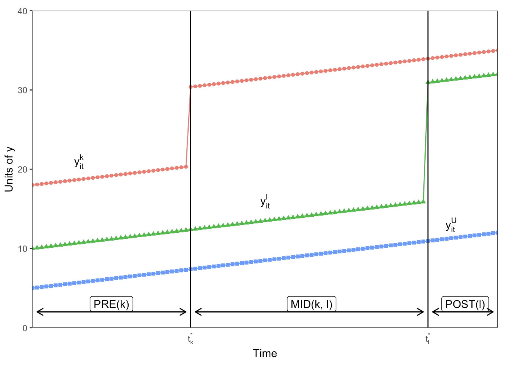

```{r setup, include=FALSE}
library(here)
library(tidyverse)
library(ggplot2)
options(htmltools.dir.version = FALSE)
library(DiagrammeR)
library(xaringan)
library(leaflet)
library(ggplot2)
library(kableExtra)
library(fixest)
library(modelsummary)
# devtools::install_github("bcallaway11/did")
library(did)
xfun::pkg_load2(c('tikzDevice', 'magick', 'pdftools'))
```

```{r, include=FALSE}
pdf2png = function(path) {
  # only do the conversion for non-LaTeX output
  if (knitr::is_latex_output()) return(path)
  path2 = xfun::with_ext(path, "png")
  img = magick::image_read_pdf(path)
  magick::image_write(img, path2, format = "png")
  path2
}
```

```{r xaringan-themer, include=FALSE}
library(xaringanthemer)
write_xaringan_theme(text_color = "#000000", header_color = "#737373", text_font_size = "24px",  text_font_family = "'Lucida Sans'", header_font_google = google_font("Source Sans Pro"), title_slide_background_color =  "#ffffff", title_slide_text_color = "#000000", link_color = "#0000ee", footnote_font_size = "0.5em")
```
## Basic setup for DD with variable timing
Say different states/provinces are exposed to a policy at different times.   
We often use OLS (or LPM) to fit:
$$y_{it} = \alpha_{i} + \tau_{t} + \beta^{DD}{D_{it}} + \epsilon_{it}$$
### where
- $y_{it}$ is the outcome for unit $i$ at time $t$.
- $\alpha_{i}$ are unit-specific fixed effects.
- $\tau_{t}$ are fixed effects for each time period.
- $D_{it}$ is a time-varying treatment indicator.
- $\beta^{DD}$ is the difference-in-differences estimate.

---
# Key points from Goodman-Bacon (2019)
.right-column[
- ### With OLS, DD with treatment timing is a variance-weighted average.
- ### Weights are a function of both group sizes *and* variances.
- ### Can lead to $\beta^{DD}$ that is a poor summary of group-specific effects.
]

---
.footnote[Graph from https://andrewcbaker.netlify.app/2019/09/25/difference-in-differences-methodology/]

.left-column[
1. Early-adopters (*k*) vs. never treated (*U*)

2. Later-adopters (*l*) vs. never treated (*U*).

3. Early (*k*) vs. later (*l*) adopters.

4. *Later (l) vs. earlier (k) adopters.*
]
.right-column[.center[
]]

---
## Tabora Maternal Newborn Health Initiative (TAMANI) 
.footnote[Source: https://commons.wikimedia.org/w/index.php?curid=47130439, Google Maps]

.pull-right[
```{r,  echo=F, out.width = 250}
knitr::include_graphics(here("talk", "Tabora.png"))
```
]

.pull-left[
```{r,  echo=F, out.width = 250}
knitr::include_graphics(here("talk", "tanzania.png"))
```
]

---
.right-column[
### Aim 1.
#### Assess the impact of CARE’s multi-component intervention on several indicators of reproductive maternal and newborn health. 

### Aim 2. 
#### Estimate the contribution of changes in the chemical composition of $PM_{2.5}$ to the overall effect on health outcomes.

### Aim 3. 
#### Examine alternative (i.e., non $PM_{2.5}$) .orange[pathways and mechanisms] that may contribute to the intervention’s impact.
]

---
## Who is treated?
.pull-right[
```{r,  echo=F, out.width = 250}
knitr::include_graphics(here("talk", "tanzania.png"))
```
]

---
## Data structure: Individual-level
.left-column[
- sba_birth = SBA present

- txdel = treated

- time = survey wave

- pid = person ID

- group = time when group first treated 

]

.right-column[
```{r d_ind, echo=FALSE}
d_ind <- readRDS(file = here("data-clean", "d_ind.rds"))

kable(head(d_ind)) %>%
  kable_styling()
```
]

---
## Data structure: Pooled by district
.left-column[
- tsba = total SBA births
- tpop = total pop

- txdel = treated

- time = survey wave

- group = time when group first treated 

]

.right-column[
```{r d_agg, echo=FALSE}
d_sba <- readRDS(file = here("data-clean", "d_sba.rds"))

kable(head(d_sba, n=9L), digits=3) %>%
  kable_styling()
```
]

---
## TWFE models (OLS)
.pull-left[
$$y_{sba} = \alpha + \beta*txdel + \gamma_{district} + \delta_{time} + \epsilon$$

- Individual and aggregate data basically identical

- Clustered SEs are also approximately the same

]
.pull-right[
```{r twfe1, echo=FALSE}
# Individual-level
twfe <- fixest::feols(sba_birth ~ txdel | district + time, 
                      data = d_ind,
                      weights = NULL, 
                      cluster = ~district)

# Pooled
twfep <- fixest::feols(psba ~ txdel | district + time, 
                      data = d_sba,
                      weights = ~tpop, 
                      cluster = ~district)

models <- list("Individual" = twfe, "Aggregate" = twfep)
modelsummary(models, gof_omit = 'DF|Deviance|R2|AIC|BIC|Log.Lik')
```
]

---
## CS Approach: Aggregate to Group-Time cohorts
```{r gt, echo=FALSE, message=FALSE}
# create group-time aggregate data
d_agg <- d_sba %>% group_by(group, time) %>%
  summarise(tsba = sum(tsba),
         tpop = sum(tpop),
         psba = tsba / tpop, # % SBA
         txdel = mean(txdel))

gt <- d_agg %>% select(group, time, psba, tpop) %>%
  pivot_wider(names_from = time, names_prefix = "t",
              values_from = c(psba, tpop))

gt %>%
  kbl(digits=3, col.names = c("Group", "Time1", "Time2", "Time3", "Time4",
          "Time5", "Time1", "Time2", "Time3", "Time4", "Time5")) %>%
  kable_styling() %>%
  add_header_above(c(" " = 1, "P(SBA)" = 5, "Total Pop" = 5))

```

---
### Callawy-Sant'Anna approach
.footnote[See https://bcallaway11.github.io/did/articles/multi-period-did.html for R, https://econpapers.repec.org/software/bocbocode/S458976.htm for Stata ]

- Includes options for different structure, SE calculation, weights, etc.

```{r csdid, message=FALSE, warning=FALSE, eval=FALSE, echo=TRUE}
# Use not-yet-treated as comparison group
did::att_gt(yname = "psba", # name of the LHS variable
  tname = "time", # name of the time variable
  idname = "dist_id", # name of the id variable
  gname = "group", # name of the first treatment period
  data = d_sba, # dataset
  xformla = NULL,
  weightsname = "tpop",
  est_method = "reg", # estimation method.
  control_group = "notyettreated", # set the control group
  bstrap = TRUE, # compute bootstrapped SE
  biters = 1000, # bootstrap iterations
  print_details = FALSE, # if TRUE, print detailed results
  panel = FALSE) # panel or repeated cross-sectional
```

---
## Estimates from CS approach
.left-column[
- Note there is no *overall* estimate

- Each treatment group has an ATT at each time period.
]
.right-column[
```{r cs_est, echo=FALSE, message=FALSE}
atts_8 <- did::att_gt(yname = "sba_birth", tname = "time", 
  idname = "p_id", gname = "group", data = d_ind, 
  xformla = NULL, weightsname = NULL, est_method = "reg",
  control_group = "notyettreated", bstrap = TRUE, 
  biters = 1000, print_details = FALSE, panel = FALSE,
  cband=FALSE)
cstable <- tidy(atts_8)
cstable %>% select(-point.conf.low, -point.conf.high) %>%
  kbl(digits=3, escape = FALSE) %>%
  kable_styling()
```
]

---
.left-column[
- Some SEs hard to understand.

- Cluster bootstrapped smaller in most cases.

- Absurdly small for ATT(4,4) that has small sample and only 4 clusters.
]
.right-column[
```{r atts, echo=FALSE, message=FALSE}
atts_i <- readRDS(here("output", "atts_i.rds"))

atts_ig <- atts_i %>%
  mutate(ll95 = att - 1.96 * se,
         ul95 = att + 1.96 * se,
         gt = paste("ATT(",group,",",time,")", sep=""),
         method = recode(method, asm = "Asymptotic",
          boot = "Bootstrapped", bootc = "Cluster\nbootstrapped"))

pse <- ggplot(atts_ig, aes(x = att, y = method, color = method)) + 
  geom_vline(xintercept = 0) + 
  geom_errorbar(aes(xmin = ll95, xmax = ul95), width=0.1) +
  geom_point() + facet_wrap(~gt) + theme_bw() +
  theme(axis.text.y = element_blank(), axis.title.y = element_blank(),
        axis.ticks = element_blank(), axis.text.x = element_text(size = 14),
        strip.text.x = element_text(size = 14),
        legend.text = element_text(size = 14),
        legend.title = element_blank())

ggsave(here("talk", "atts_se.png"), pse,  width = 9, height = 6)
```

```{r attse, echo=FALSE}
knitr::include_graphics(here("talk", "atts_se.png"))
```
]

---
### Creating the Group-Time ATTs
- ATT(.red[2],.blue[2]) means estimating ATT .blue[*at time 2*] for the group .red[*first treated at time 2*]

- For ATT(2,2) the groups being compared are:
```{r gt22, echo=FALSE}
# drop pop estimates
gt <- d_agg %>% select(group, time, psba) %>%
  pivot_wider(names_from = time, names_prefix = "time",
              values_from = psba)
gt %>%
  kbl(digits=3, escape = FALSE) %>%
  kable_styling() %>%
  column_spec(2:3, color = "black", background = "red") %>%
  row_spec(2:4, background  = "lightgray") %>%
  column_spec(4:6, background = "white") %>%
  column_spec(1, background = "white") %>%
  kable_minimal() %>%
  footnote(general = "Red = treated, Gray = untreated")
```

---
```{r gt22a, echo=FALSE}
# drop pop estimates
gt <- d_agg %>% select(group, time, psba) %>%
  pivot_wider(names_from = time, names_prefix = "time",
              values_from = psba)
gt %>%
  kbl(digits=3, escape = FALSE) %>%
  kable_styling() %>%
  column_spec(2:3, color = "black", background = "red") %>%
  row_spec(2:4, background  = "lightgray") %>%
  column_spec(4:6, background = "white") %>%
  column_spec(1, background = "white") %>%
  kable_minimal() %>%
  footnote(general = "Red = treated, Gray = untreated")
```

- The 2x2 (weighted averages):
```{r att22, echo=FALSE, message=FALSE}
d_agg %>% filter(time < 3) %>%
  mutate(g22 = if_else(group==2,1,0)) %>%
  group_by(g22, time) %>%
  summarise(tsba = sum(tsba),
            tpop = sum(tpop),
            psba = tsba / tpop) %>%
  select(g22, time, psba) %>%
  pivot_wider(names_from = time, values_from = psba,
              names_prefix = "time") %>%
  mutate(`Long diff` = `time2` - `time1`) %>%
  group_by() %>%
  mutate(ATT_2_2 = `Long diff` - lag(`Long diff`, default = NA)) %>%
  kable(digits=3) %>%
  column_spec(5, bold=TRUE) %>%
  kable_minimal()
```

This estimate says that intervention increased the probability of an SBA birth by 0.01 for Group 2 at Time 2.

---

- For ATT(2,3) the groups being compared are:
```{r gt23, echo=FALSE}
# drop pop estimates
gt %>%
  kbl(digits=3, escape = FALSE) %>%
  kable_styling() %>%
  column_spec(c(2,4), color = "black", background = "red") %>%
  row_spec(2, background = "white") %>%
  row_spec(3:4, background  = "lightgray") %>%
  column_spec(c(3,5,6), background = "white") %>%
  column_spec(1, background = "white") %>%
  kable_minimal() %>%
  footnote(general = "Red = treated, Gray = untreated")
```


### Note
- ATT(.red[2],.blue[3]) means estimating the ATT .blue[*at time 3*] for the group .red[*first treated at time 2*]

- Need to exclude any group treated at time 3 to avoid bias.

- The group first treated at time 3 is excluded.

---
- The 2x2 (weighted averages):
```{r att23, message=FALSE}
d_agg %>% filter((time==1 | time==3) & group!=3) %>%
  mutate(g23 = if_else(group==2,1,0)) %>%
  group_by(g23, time) %>%
  summarise(tsba = sum(tsba),
            tpop = sum(tpop),
            psba = tsba / tpop) %>%
  select(g23, time, psba) %>%
  pivot_wider(names_from = time, values_from = psba,
              names_prefix = "time") %>%
  mutate(`Long diff` = `time3` - `time1`) %>%
  group_by() %>%
  mutate(ATT_2_3 = `Long diff` - lag(`Long diff`, default = NA)) %>%
  kable(digits=3) %>%
  column_spec(5, bold=TRUE) %>%
  kable_minimal()
```

---
## Questions
.right-column[
### Aggregating

### Clustering
]
